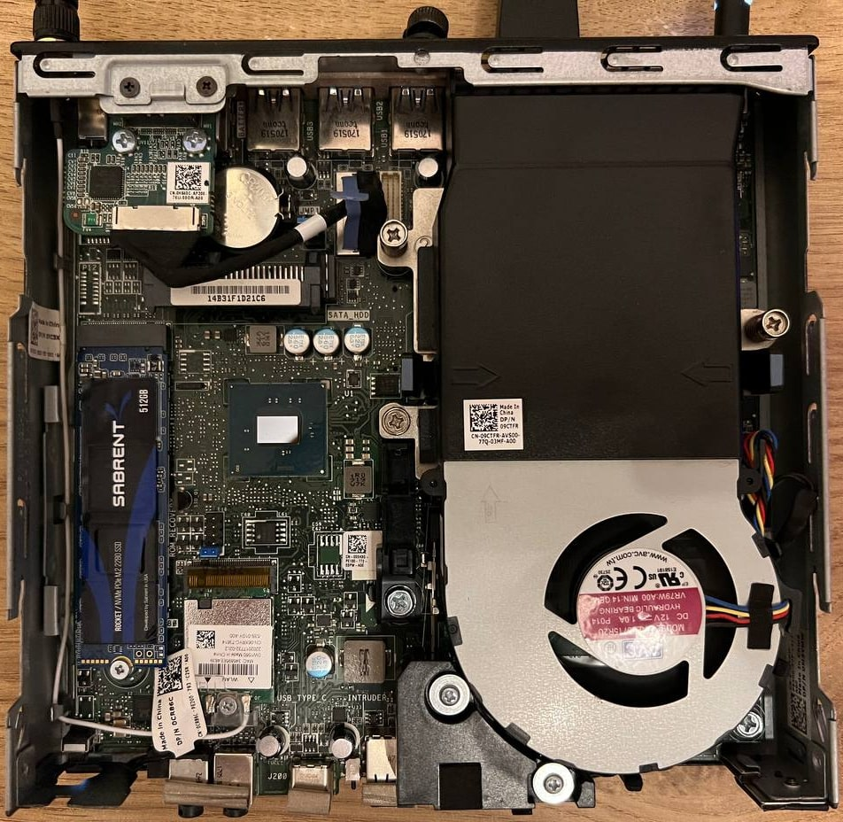

# Dell Optiplex 7050 Micro OpenCore 1.0.0


This repository contains my personal EFI configuration for the fantastic Dell Optiplex 7050 Micro.

I am currently dual-booting macOS Sonoma 14.5 (23F79) with [OpenCore](https://github.com/acidanthera/OpenCorePkg) 1.0.0 and Windows 11 24H2 on the same Sabrent drive with with macOS on a 448GB partition and Windows on a 64GB partition. Easy to switch between both OSes by pointing to their respective .efi bootloaders in the BIOS and picking them in the Dell Boot Menu.

Catalina was installed prior to Big Sur and it worked perfectly. Monterey also ran without issues. Ventura was no problems at all. I aim to have as clean of configuration as possible and so far everything has been working great.

I use Macmini8,1 as my SMBIOS. iMac18,1 is also a good alternative, depends what you want it to show up as (have used both SMBIOS with no issues). This is for reference only, it may or may not work on your machine, depending how close to the config you are. For example, if it's a bigger version of the Optiplex 7050, then it should work with minimal changes.

This was setup using the latest Dell BIOS at the time: [1.14.0](https://www.dell.com/support/home/en-uk/drivers/driversdetails?driverid=80chv&oscode=wt64a&productcode=optiplex-7050-desktop). I have successfully updated to [1.15.1](https://www.dell.com/support/home/en-uk/drivers/driversdetails?driverid=jkt52&oscode=wt64a&productcode=optiplex-7050-desktop) and then [1.15.2](https://www.dell.com/support/home/en-uk/drivers/driversdetails?driverid=2xjd2&oscode=wt64a&productcode=optiplex-7050-desktop) after the fact with no issues (via Windows or the built in BIOS Update Utility). 

Currently, BIOS version [1.24.0](https://www.dell.com/support/home/en-uk/drivers/driversdetails?driverid=hy8pf&oscode=wt64a&productcode=optiplex-7050-desktop) is installed and running as normal.

If you are starting from scratch, I recommend updating to the latest BIOS and completely resetting it before anything else.

This has mostly been created with the help of the [Vanilla Hackintosh Guide by Dortania](https://dortania.github.io/OpenCore-Install-Guide/) and my own personal experience.

I recommend using [OpenCore Configurator](https://mackie100projects.altervista.org/download-opencore-configurator/) to edit your config.plist and use the built in checker to validate if everything you did was correct. I personally use it all the time to update my setup. I know there are other tools and you can use them such as [Xcode](https://apps.apple.com/us/app/xcode/id497799835) or [ProperTree](https://github.com/corpnewt/ProperTree), but I prefer an easy GUI.

**Attention! This repository is tailored exactly to the Optiplex 7050 Micro. This OpenCore configuration may or may not work on the other bigger versions like the 7050 SFF, but it's mainly made for the Micro version.**

**You are welcome to try running it and it may even work for other similar Optiplex versions like the 7040 or 7060, but keep in mind you will need to change some CPU/GPU, USB and other devices configurations to make it work. With this repo, you should be able to just enter your PlatformInfo variables and install macOS.**

As always, double/triple check everything to make sure, it's a relatively light setup, but better safe than sorry!

## Final product showcase

If all goes well, this is what the final product should look like, the entire boot process from start to finish. If you're not dualbooting then you can ignore the "Windows Boot Manager" and "macOS Boot Manager" part of the video:

https://github.com/linkev/Dell-Optiplex-7050-Micro-Hackintosh/assets/13016565/637bbedf-527e-4ffb-9a30-4245c1ddc71c

## macOS Sonoma and later WiFi notes

macOS Sonoma has removed Broadcom WiFi card support we all know and love. This means cards like DW1560/DW1820a which I have used with this build before are no longer working. You can make them work with [OpenCore Legacy Patcher](https://dortania.github.io/OpenCore-Legacy-Patcher/), but I decided that is too much headache and simply put in an Intel 9260NGW WiFi card along with [AirportItlwm](https://github.com/OpenIntelWireless/itlwm). It's a shame we lose AirDrop and other Continuity features, I'm only glad we still have Location support.

If you want to try to make your Broadcom WiFi work, Google is your friend. From my anecdotal research on Reddit, it seems like you need to disable SIP and run [OpenCore Legacy Patcher](https://dortania.github.io/OpenCore-Legacy-Patcher/), which should inject whatever you need to make WiFi work and you will need to rerun it everytime there is a macOS update. I prefer having SIP on and using one kext.

- You may need to add `brcmfx-country=#a` if you are going to use Broadcom WiFi

## Hardware Configuration


- Intel i7-7700 CPU (Not the T version, the full desktop 65W version, kinda overkill and probably runs at 45W) (I don't think the CPU matters, they're all relatively the same)
- 16GB RAM Samsung DDR4 @ 3200 MHz, but running @ 2400 MHz, because Intel/Dell limits the speed
- Intel HD Graphics 630 1536 MB
- Sabrent Rocket 512GB in the NVMe slot
- Samsung 860 QVO 1TB in the SATA slot
- Intel® Wireless-AC 9260 Wi-Fi 5 + Bluetooth 5.1
- Intel I219-LM Gigabit Ethernet
- Integrated speaker at the front, works perfectly with `alcid=11`
- 1 Displayport 1.2
- 1 HDMI 1.4
- 1 Addon Displayport port, works in Windows, doesn't work in macOS, came with the specific Optiplex I bought
- 1 USB-C Port and 1 USB-A port at the front
- 1 headphone jack and 1 microphone port at the front
- 4 USB-A ports at the back
- 130 watt Dell power supply

## What works and what doesn't

### Working

- [x] APFS
- [x] CPU power management
- [x] GPU acceleration
- [x] Video encoder/decoder hardware
- [x] All USB ports at their max speed (No USBMap, but they work nonetheless)
- [x] Gigabit Ethernet
- [x] Secure Boot (SIP)
- [x] WiFi and Bluetooth
- [x] Location Services
- [x] Onboard Audio + Integrated Speaker at the front
- [x] iMessage (set your Serial Number, System UUID, MLB and ROM correctly)
- [x] All iCloud Services
- [x] App Store
- [x] FaceTime
- [x] Handoff
- [x] AirPlay
- [x] Continuity
- [x] DRM:
  - iTunes Movies (FairPlay 1)
  - Netflix (FairPlay 2/3)
  - Amazon Prime (FairPlay 2/3)
  - Apple TV+ (FairPlay 4)
- [x] NVRAM
- [x] FileVault
- [x] Dell Sensors (Fans/Temperature) (Control the fan with [exelban Stats](https://github.com/exelban/stats))
- [x] Built in Displayport 1.2 and HDMI 1.4
- [x] TRIM working on Sabrent NVMe
- [x] TRIM enabled for SATA SSD with `sudo trimforce enable`
- [x] Sidecar
- [x] Various sharing functions like Content Caching (very useful if you have lots of Apple devices)
- [x] Time Machine
- [x] Seamless software updates (Thanks to [RestrictEvents](https://github.com/acidanthera/RestrictEvents) and `revpatch=sbvmm` in NVRAM)
- [x] Continuity Camera via USB

### Not Working

- [ ] Sleep/Wake (it goes to sleep, it wakes up, but the display never comes on)
- [ ] Booting up without a monitor (Headless mode)
I had to buy a dummy Displayport which activates the iGPU and performs normally with it. There may be some extra configuration required in DeviceProperties, since it currently has very minimal entries.
I'm using [Parsec](https://parsec.app/) to remote in and it's been working fantastic so far.
- [ ] Unlock with Apple Watch (Since macOS Sonoma)
- [ ] AirDrop (Since macOS Sonoma)
- [ ] Monterey's AirPlay to Mac with [FeatureUnlock](https://github.com/acidanthera/FeatureUnlock) (Assuming since macOS Sonoma, used to work)

## Pictures

Here are some internal pictures, as well as the back ports, just for this guide's completeness sake. You can see the front ports in the main image above, it's a relatively small and light machine.




## Getting Started

First, download the entire repository or just the OpenCore EFI .zip file from [Releases](https://github.com/linkev/Dell-Optiplex-7050-Micro-Hackintosh/releases).

###  **Make sure you add your System Serial Number, System UUID, MLB and ROM in PlatformInfo before booting!**

Open the config.plist with [OpenCore Configurator](https://mackie100projects.altervista.org/download-opencore-configurator/), go to PlatformInfo on the left, click DataHub - Generic - PlatformNVRAM at the top and fill in these fields:


Only things you need to set manually is the **System Serial Number**, **System UUID**, **MLB** and **ROM**. I have set them as **{CHANGE ME}** or **00 00 00 00 00 00** in the **ROM** section. They're highlighted in orange. [OpenCore](https://github.com/acidanthera/OpenCorePkg) ([OpenCore Configurator](https://mackie100projects.altervista.org/download-opencore-configurator/) as well) will complain if you do not set them correctly. You can get the first three created with [GenSMBIOS](https://github.com/corpnewt/GenSMBIOS). The ROM part can be your Ethernet or WiFi MAC Address such as **E4 85 G6 M8 H9 2Q**, for example. Refer to the [Vanilla Hackintosh Guide by Dortania](https://dortania.github.io/OpenCore-Install-Guide/) if you need more help.

## NVRAM values explained

- Verbose mode can be enabled by adding `-v` to boot args and it may help troubleshoot. I left it off by default.
- AppleALC ID is `-alcid=11` to make the headphone jack work as well as the internal speaker.
- To force the display/GPU to activate, `igfxonln=1` is added, I was having issues when you boot up without a display attached. This could probably be removed.
- To enable seamless macOS updates, [RestrictEvents](https://github.com/acidanthera/RestrictEvents) kext and `revpatch=sbvmm` value to boot args need to be added, otherwise software update fails on first try and second try downloads the entire 13GB+ package.

## Preparation

- Update to the latest BIOS if you can.
- Once on the latest BIOS, reset it to defaults (maybe even go as far as taking the CMOS battery out for a few minutes to hard reset).
- Make sure CFG Lock is **Disabled**. Alternatively, enable AppleCpuPmCfgLock and AppleXcpmCfgLock in Kernel, however, it's better for performance to disable CFG Lock with the **Modify UEFI** explained below. You can also use the **Unlock CFG** tool included to find the bit and flip it between Enabled and Disabled. [More info here](https://dortania.github.io/OpenCore-Install-Guide/config.plist/kaby-lake.html#kernel).
- Avoid Samsung PM drives as they did not let me go past the installer, it would always crash. It may be fixed with NVMEFix.kext, I just bought a Sabrent SSD instead. ADATA SSD's seem to work as well, according to [AshkanAbd](https://github.com/linkev/Dell-Optiplex-7050-Micro-Hackintosh/issues/20#issuecomment-2132219453). I never got Samsung/Toshiba drives to work with the installer (they come as default with XPS/Optiplex computers).
- For Big Sur and newer, but before Sonoma, if you're using Dell Wireless 1560/1820A or something similar, make sure to modify your config [according to the "Please pay attention" section](https://github.com/acidanthera/AirportBrcmFixup#please-pay-attention), otherwise it will take forever to boot into the installer.

## BIOS Settings

[The entire BIOS settings can be found here](BIOS.md)

## Prepare a bootable USB drive

**FYI, do not use an Apple Silicon Mac with M1/2/3/4 etc. chips to download from the Mac App Store. They will download the ARM64 installer, not the AMD64 installer we need for Intel CPU's. You can still use an Intel Mac to download the installer from the Mac App Store, but it may download a partial update rather than the full version, it's easier to use Mist explained below**

You can either use the official [OpenCore guide here](https://dortania.github.io/OpenCore-Install-Guide/installer-guide/)

Or if you already have a legitimate Intel Mac or a working Hackintosh, you can download [Mist](https://github.com/ninxsoft/Mist) and download the full installer this way. Then simply format your USB to Mac OS Extended (Journaled) with Disk Utility, name the USB something simple like `USB`.

Then open Terminal and type `sudo` and spacebar after. Navigate to Finder > Applications (or wherever you downloaded the .app) > Right click Install macOS Sonoma (or whatever other version you're trying to install) > Show Package Contents > Contents > Resources > Drag the `createinstallmedia` script file into Terminal which should fill out the path. Then spacebar, add `--volume`, spacebar again and the path of your USB drive. Press enter, type in your administrator password and it should make a bootable macOS Installer.

Your Terminal command should look like this:

```
sudo /Applications/Install\ macOS\ Sonoma.app/Contents/Resources/createinstallmedia --volume /Volumes/USB
```

Once it's done, mount the USB drive's EFI partition and copy over your modified OpenCore EFI folder.

## First USB boot

Turn on your Optiplex, mash F12 on your keyboard to get into the boot menu and select the USB we prepared.

If all went well, you should see this:


This is the final product boot menu, yours will have extra entries like your USB, no Windows entry etc. Don't select the `Install macOS` option yet, we need to change our hidden BIOS options first.

This is what each boot option means:

- macOS boots into macOS of course
- Recovery boots the Recovery partition to do things like repair your installation or disable SIP etc, like on a real Mac
- Check CFG will tell you the status of the CFG MSR E2 value
- Unlock CFG will find the CFG MSR E2 value and let you toggle it on or off
- Modify UEFI lets you modify hidden values in the UEFI BIOS
- Firmware Settings is a quick shortcut to reboot into BIOS, if you forgot to click F12 on boot
- Reset NVRAM does what the name suggests, clear out any NVRAM values, useful when you toggle `-v` verbose mode in config.plist, but the setting doesn't stick and you're stuck without a pretty Apple logo

## Set the UEFI Variables

Our Dell Optiplex 7050 BIOS has a few options hidden from us which we need to set with the tools provided in the OpenCore boot menu. Below are the values which must be set in order for macOS to boot and work properly.

| Variable name          | Offset | Default value  | Required value  | Description                                                         |
|------------------------|--------|----------------|-----------------|---------------------------------------------------------------------|
| CFG Lock               | 0x4ED  | 0x01 (Enabled) | 0x00 (Disabled) | Disables CFG Lock, otherwise you won't be able to boot              |
| DVMT Pre-Allocated     | 0x795  | 0x01 (32M)     | 0x02 (64M)      | Increases DVMT pre-allocated size to 64M which is required          |
| DVMT Total Gfx Mem     | 0x796  | 0x01 (128M)    | 0x03 (MAX)      | Increases total gfx memory limit to maximum                         |
| Bi-directional PROCHOT | 0x527  | 0x01 (Enabled) | 0x00 (Disabled) | Disables PROCHOT, which limits your CPU to 0.79GHz. More info below |

### CFG Lock - Automated Way

You can use the tool included to find your hidden CFG Lock value and toggle it. These are **Check CFG** which is included with OpenCore and **Unlock CFG** which is CFG Lock bit finder and toggle tool, it was used before the [OpenCore](https://github.com/acidanthera/OpenCorePkg) tool existed to change the value. They both kind of do the same job, you can add a `lock` or `unlock` argument to `ControlMsrE2.efi` in `config.plist` and Misc > Tools, or just use **Unlock CFG** and it should do the job for you.

First, run **Check CFG** to see the status of CFG Lock. If you're just starting out or reset the BIOS, it will say `This firmware has LOCKED MSR 0xE2 register!`

Press any key to go back and select **Unlock CFG**. It should find the value and offer you to toggle it. Press `y` and then any key to go back again:


Restart your computer back to [OpenCore](https://github.com/acidanthera/OpenCorePkg) and open **Check CFG** again, this time it should tell you it's unlocked:


Congratulations! However, you will still need to use the manual way below to change the DVMT variables.

### DVMT variables (and/or CFG Lock) - Manual Way

You need to change some variables even if the CFG Lock was unlocked automatically. Select **Modify UEFI** and enter the following commands to change the values. Below is what the final screen should look like, it's fairly straightforward:


Here is what you have to type out for each line, CFG Lock:

```
setup_var 0x4ED 0x00
```

For DVMT:

```
setup_var 0x795 0x02
```

```
setup_var 0x796 0x03
```

If you're disabling BD PROCHOT, enter this (optional):

```
setup_var 0x527 0x00
```

Make sure to restart after any changes, they should apply. You'll know if it worked when you can boot **Install macOS Sonoma** from your USB and arrive at the setup screen.

## Installation

If you've successfully arrived at the macOS setup screen, congratulations! Open Disk Utility, format your internal SSD to APFS, close Disk Utility, launch the Installer and follow the instructions. Anytime your computer restarts, just use [OpenCore](https://github.com/acidanthera/OpenCorePkg) to boot the last selected entry (you will restart a few times before you actually get to macOS). Make sure you have your USB plugged in and boot from it until you copy over the EFI to the Internal SSD.

After you're at the desktop, connect to the internet, download [OpenCore Configurator](https://github.com/linkev/Dell-Optiplex-7050-Micro-Hackintosh/issues/20#issuecomment-2132219453) again, mount the USB EFI, copy EFI folder to the Desktop, mount the Internal SSD EFI, copy it over just like the USB had and you should be able to no longer depend on booting via USB.

If you ever clear the NVRAM, reset BIOS or remove boot entries, you should manually re-add the `BOOTx64.efi` file into your boot list in the Dell BIOS and OpenCore will work again. This isn't a problem if you're not dual-booting Windows. Windows tends to override any boot entry and make itself the first one, thanks Microsoft.

That's it! Enjoy your brand new Mac ;)

## Miscellaneous thoughts

I am using [exelban's Stats](https://github.com/exelban/stats) to monitor CPU, GPU, Memory, Disk, Temperatures, Fan Speed and Network.

This has been a great Plex Server throughout it's use, very good Minecraft server too and have Wireguard VPN Server setup with [this guide](https://barrowclift.me/post/wireguard-server-on-macos).

As for the Bi-directional PROCHOT (BDPROCHOT), I've encountered this several times at work with our Dell machines and finally figured out how to stop it or at least suppress it. What happens is either a sensor dies, misinforms the BIOS or just the power supply is crappy and sends signals all over the place which in turn locks your CPU to a low power state.
Sometimes it's 0.79GHz, sometimes a little bit higher or lower, but the result is an EXTREMELY slow system.
The computer thinks it's essentially on fire and limits everything it can to save itself. However, in reality, the cooling is more than enough and no overheating is ocurring. I've had to replace a few motherboards under warranty to fix this issue before, but I found out that you don't need to do any of that, you just set the variables hidden in the BIOS as shown above. Of course, this remove the temperature checks/protections and could result in your computer overheating, so exercise caution with this option. I'm sure other CPU overheating protections would kick in regardless, but this probably voids your warranty, unless you reset the BIOS completely before sending your computer in.
Rambling aside, I will be making a tutorial on how to find the variable and turn it off and get your CPU speed back up to normal in the future.
